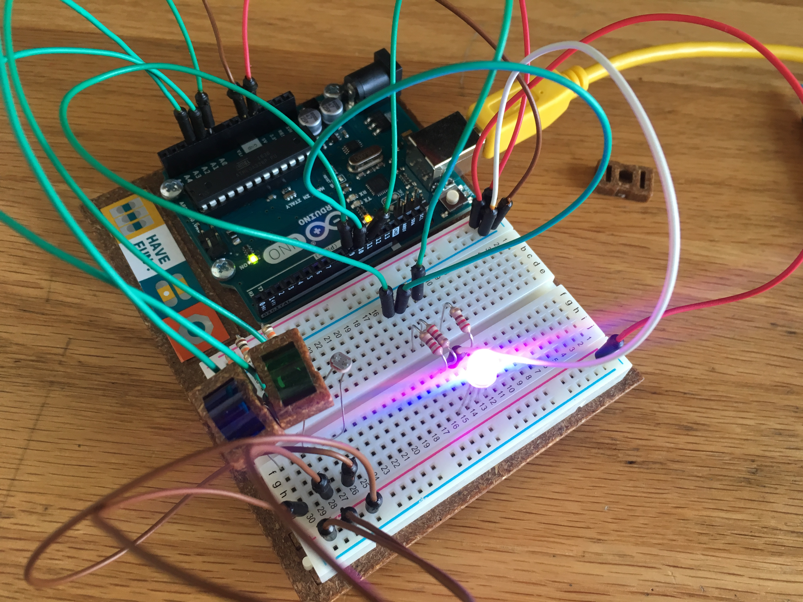

# Love-O-Meter

Ever seen one of these?

Hold it in your palm and it'll tell you how good of a lover you are. How it
really works is by heat. The heat of your palm evaporates some of the liquid,
causing the top to be filled.

It turns out it's quite easy to make a digital version with Arduino. Simply
throw together some LEDs and a digital thermometer and here it is!

As the temperature sensor warms up, the LEDs light up in a row. When I take my
hand off, the sensor cools and the LEDs turn off.

# Color-Mixing-Lamp

Imagine a simple lamp where you can change the color to be any mix of red,
green, and blue. With Arduino, this is quite simple too. An RGB LED allows you
to light up its component lights with certain intensity. You can also use
Photoresistors to measure the amount of light, and cover each with a different
film, so you can measure the intensity of the components. Then you can cover
whichever photoresistor you want to make your color any shade.

Unfortunately, I lost my red film, so the colors are a bit off. Even when
covering up the film, the colors didn't really blend well and they showed
up on the camera even worse, so this project doesn't have a video.
